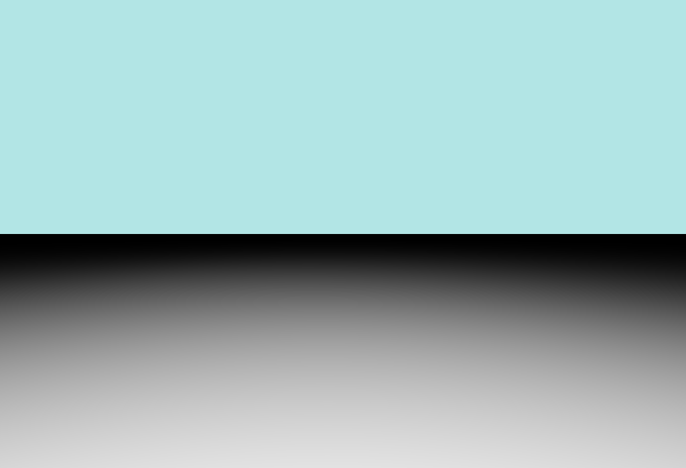
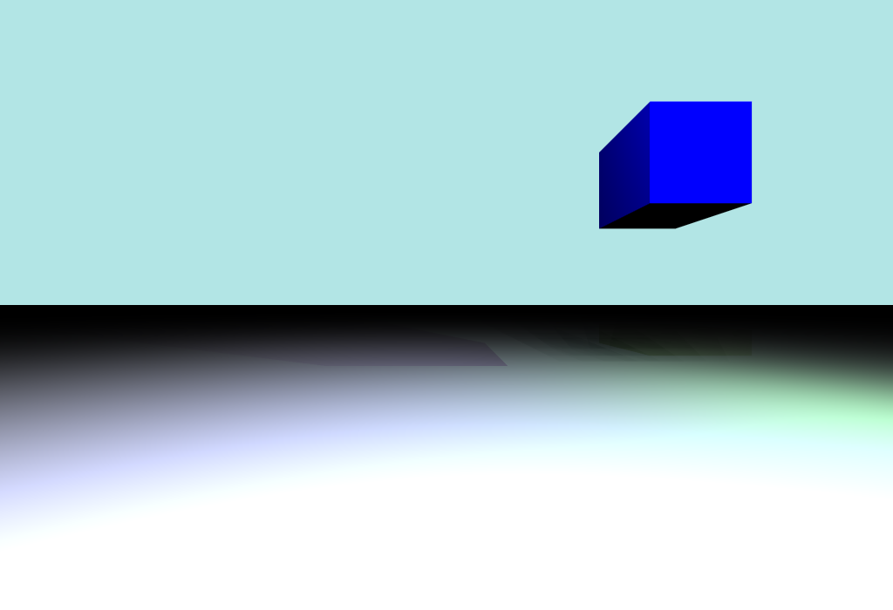

# Rapport du Projet de Synthèse (LIFIMAGE)

## Introduction
Ce rapport détaille le projet situé dans le répertoire `LIFIMAGE/gkit3`. Il inclut une description des objectifs, de l'architecture globale, des fonctionnalités implémentées, ainsi que des essais et expérimentations. Ce projet implémente une simulation graphique en utilisant des primitives géométriques (sphères, cubes, plans) et des sources lumineuses pour générer des images réalistes.

---

## Architecture du Projet
Le projet est structuré comme suit :
- **`gkit/`** : Fournit des bibliothèques et outils graphiques nécessaires.
- **`src/`** : Contient les fichiers sources principaux, y compris les fichiers `.h` et `.cpp`.
- **`projet/`** : Contient les fichiers spécifiques ajoutés ou modifiés pour répondre aux besoins de la simulation.
- **`obj/`** : Contient les fichiers `.o` et `.d` nécessaires à la compilation.
- **`bin/`** : Contient les fichiers exécutables du projet, `bin/projet` pour générer l'image de rendu.

---

## Fonctionnalités Bonus Implémentées

### 1. Matières Réfléchissantes
- **Description** : Les objets de la scène (sphères, cubes, plans) peuvent réfléchir la lumière, simulant des effets réalistes.
- **Implémentation** :
  - La structure `Hit` (dans [`hit.h`](#)) inclut un champ `mirror` représentant le pourcentage de lumière réfléchie.
  - La fonction `affichage` (dans [`projet.cpp`](#)) calcule les réflexions en utilisant la direction miroir et applique le coefficient de réflexion de Fresnel.
- **Résultat** : Les objets réfléchissants ajoutent du réalisme à la scène, comme visible dans les images générées.

### 2. Flou de Profondeur
- **Description** : Ajout d'un effet de flou pour simuler la profondeur de champ.
- **Implémentation** :
  - Utilisation de plusieurs rayons par pixel (antialiasing) dans la fonction `affichage` (dans [`projet.cpp`](#)).
  - Les rayons sont légèrement décalés aléatoirement pour simuler un flou réaliste.
- **Résultat** : Les objets proches et éloignés apparaissent flous, tandis que les objets au point focal restent nets.

### 3. Une Surprise : Le Cube
- **Description** : Ajout d'une primitive géométrique supplémentaire, le cube, pour enrichir la scène.
- **Implémentation** :
  - La structure `Cube` est définie dans [`cube.h`](#).
  - La fonction `intersect` (dans [`projet.cpp`](#)) gère les intersections entre un rayon et un cube.
- **Résultat** : Les cubes sont correctement intégrés à la scène et interagissent avec la lumière comme les autres objets.

---

## Ce qui n'a pas fonctionné
### 1. Réfraction des Objets
- **Essai** : Implémentation d'une réfraction réaliste pour les objets transparents.
- **Problème** : Les calculs de direction réfractée et les indices de réfraction n'ont pas produit les résultats attendus.
- **Conclusion** : Cette fonctionnalité reste à améliorer dans une version future.

### 2. Ombres Douces
- **Essai** : Génération d'ombres douces en utilisant des sources lumineuses étendues.
- **Problème** : Les ombres apparaissent bruitées ou incohérentes en raison d'un échantillonnage insuffisant.
- **Conclusion** : Nécessite une optimisation des algorithmes d'échantillonnage.

---

## Résultats Visuels
Voici quelques images générées par le projet :

1. **Réflexions** : Une sphère réfléchissante avec un plan en arrière-plan.
   

2. **Flou de Profondeur** : Une scène avec plusieurs objets à différentes distances.
   

3. **Surprise - Cube** : Une scène mettant en avant un cube coloré.
   

---

## Conclusion
Ce projet est une implémentation robuste d'une simulation graphique basée sur le lancer de rayons. Les fonctionnalités implémentées, comme les matières réfléchissantes et le flou de profondeur, ajoutent du réalisme à la scène. Bien que certaines expérimentations n'aient pas abouti, elles ouvrent des perspectives pour des améliorations futures.

---

## Annexes
- **Références** :
    - Documentation de la bibliothèque `gKit`.
    - Ressources en ligne sur le lancer de rayons.
- **Glossaire** :
    - **Ray Tracing** : Technique de rendu simulant le comportement des rayons lumineux.
    - **Intersection** : Calcul du point où un rayon rencontre un objet.
    - **Réflexion** : Déviation d'un rayon lumineux sur une surface réfléchissante.
    - **Flou de Profondeur** : Effet simulant la mise au point d'une caméra.

---

## Vérification des Fonctionnalités
1. **Matières Réfléchissantes** : Implémentées dans `Hit` et `affichage` (voir [`projet.cpp`](#)).
2. **Flou de Profondeur** : Géré par l'antialiasing dans `affichage`.
3. **Cube** : Défini dans [`cube.h`](#) et géré dans `intersect` (voir [`projet.cpp`](#)).